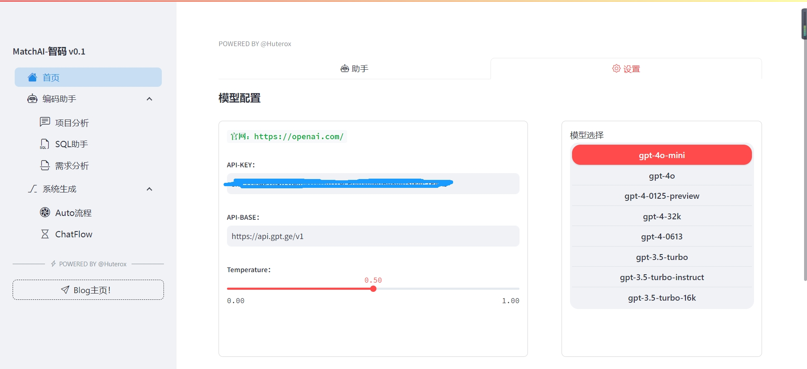
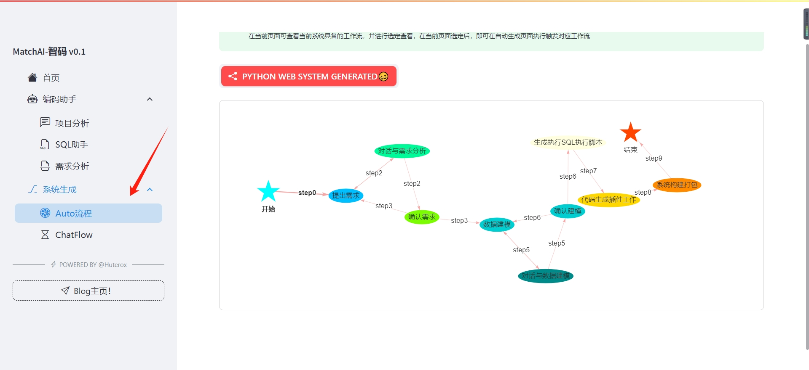
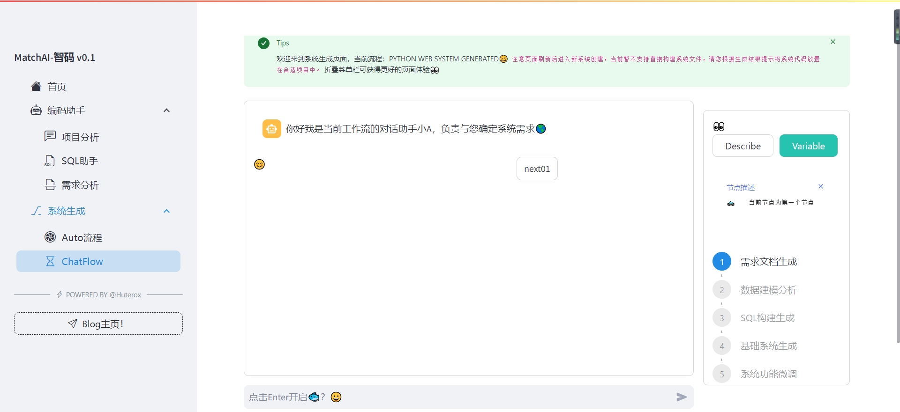

# AutoDevOps-oups: AI-Driven Software Development Automation Solution & AI Tools for Software Building
<p align="center">
<a href="docs/README_CN.md"></a>
<a href="docs/README_EN.md"></a>

</p>

### 💡 Get Help - [Q&A](https://gitee.com/Huterox/auto-dev-ops-oups/issues)

<hr/>

## 介绍1️⃣

AutoDevOps-oups 是一个基于AI的软件开发自动化解决方案，它利用AI技术来辅助软件开发过程，交互组件基于Streamlit开发完成。旨在快速完成逻辑功能开发，完成验证版本开发。
当前版本完全开源，并处于功能验证阶段，我们欢迎广大开发者参与其中，共同完善这个项目。✔ 同时为了便于学习Agent开放，当前项目存在较多轮子组件，便于理解其底层实现思想。


## Features and Benefits2️⃣

- 编码问答助手，支持读取本地项目，读取项目目录结构，分析代码依赖，协助用户阅读项目源码🍳
- SQL助手，当前并未对驱动进行抽象封装，暂时只支持MySQL数据库。输入设置数据库连接，即可使用SQL助手，协助分析数据库设计，查询语句编写🐟
- 项目需求助手，Agent将扮演项目经理，协助整理相关项目需求，同时内置Whisper可提取音频文件，后续集成替换为FunASR。
- 工作流实现&项目代码生成，在当前项目，我们实现了一个简易的非可视化工作流（旨在学习工作流底层实现原理），并基于该工作流实现了一个系统代码生成流程。
  - 对话式分析项目需求
  - 根据需求设计数据库
  - 根据数据库设计，生成创建执行代码
  - 后端指定技术栈为Python Fast API 前端指定技术栈为Vue3 生成基础系统代码（CURD）
  - 基于基础代码与用户确定需求生成需求业务代码
  - 对话式修改当前系统代码
  - ❌ 暂不支持 😣
    - 全自动化流水生成代码，在操作过程当中，我们要求由用户自己切换工作流状态（交互式点击下一步）因为我们无法直接确定当前工作流输出结果是否为用户所需。
      后续版本，我们将实现 monitor manger 去自动检测整个workflow的执行结果，以及并且节点组件。
    - 考虑到当前模型的性能差异，我们取消了直接将代码生成至基础工程当中，而是采用markdown说明的形式，将系统代码进行输出。这个过程类似于`我们提供积木组件，需要用户按照参考说明进行组装。而不是由我们自动组装，但这一功能并不是不能实现`
    
    
## 快速开始3️⃣

注意在开始之前，请准备好你的OpenAI key,这非常重要，在项目根目录创建文件：
api.toml
内容如下：
(注意：请将sk-替换为你的key，同时可以使用相关中转站服务来请求使用OpenAI)

[OpenAI中转站🌎](https://api.v3.cm/register?aff=Z9EP)


```yaml
[DEFAULT]
default_key = "sk-"
default_base = "https://api"
default_model = "gpt-4o"
default_temperature = 0.5

[WHISPER]
openai_whisper_api = false
faster_whisper_model_default = "tiny"
faster_whisper_model_local = true
faster_whisper_model_local_path = "F:/new/model/tiny"
gpu = false
vad = false
lang = "自动识别"

[MORE]
min_vad = 500
beam_size = 5
whisper_prompt = "Please break sentences correctly and retain punctuation."
temperature = 0.5
crf = 23
quality = "medium"
ffmpeg = "libx264"
log = "error"

```

### 📦 本地部署

如果你想要本地源码，部署请按照如下操作进行：
- Python 3.10+ 作者开发环境为3.10版本，因此推荐在本地部署时使用>=3.10版本
- ```cmd
  pip install -r requirements.txt
   ```
- 执行指令：

  ```cmd
  streamlit run main.py --port=8080
  ```

### 🚀 Docker 快速部署
同时，我们依然提供了dockerFile，方便用户快速部署。
- 执行指令：

  ```cmd
  docker build -t AutoDevOps-oups:latest .
  ```

  ```cmd
  docker run -p 8080:8081 AutoDevOps-oups:latest
  ```
  容器内部服务默认暴露8080~
  
如果一切顺利，访问浏览器服务器端口，即可进入到软件首页。
软件首页如下图所示：


## 基本使用4️⃣
这里我们将主要快速介绍当前软件的基本使用。
### 项目助手 😶
在此之前请确保你已经申请并具备了OpenAI key，并在首页的设置项目当中进行了设置填写。

当你对项目功能存在相关疑问时，你可以询问项目助手。

### 项目系统生成🏎
其余功能，在对应页面由详细的操作提示，只需要按照相关提示即可进行操作，但是对应系统生成来说，依然存在较多的细节需要注意。
1. 流程选定，虽然当前系统只有一个流程，但是在后期将对此模块进行优化，增加新的流程。因此在使用系统生成之前，需要先进入下面的页面选定流程
    同时，在选定页面，也将展示流程的执行示意图。
     
2. 系统生成对话，在选定之后（当前只有一个，因此为默认勾选，但不设定，因此需要进入选定页面，设定）
    之后进入操作页面如下：
    
    在这里有如下几点需要注意：
   1. 在右侧边栏，可以查看当前流程的执行示意图。
   2. 重点注意右侧边的Variable按钮，该按钮可以查看当前流程执行的结果，当切换流程执行为下一步时，该值将覆盖切换，因此请即使查看结果，也请及时保存。
   3. Describe与Variable实际上是一组CheckButton，当你选择Variable后，后续都会默认执行Variable，也就是，每次自动打开查看结果。如果需要取消请点击Describe。
      此设计主要为防呆设计。

## 后续迭代方向💫
- 增加更多的流程，以满足更多的需求。
- 抽离streamlit实现功能，切换前端结束栈，主要出于一下考量
  - 性能考量与项目后续工程化处理
  - 集成可视化流程，后端流程引擎可能考虑基于当前流程实现，或基于LangChainFlow进行二次开发
- 系统生成发展方向确定
  - 以母港的形式生成系统 1️⃣
  - 以组件的形式集成系统 2️⃣