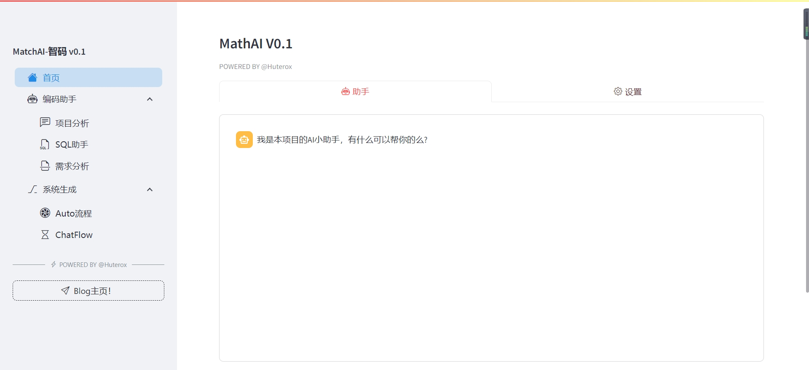
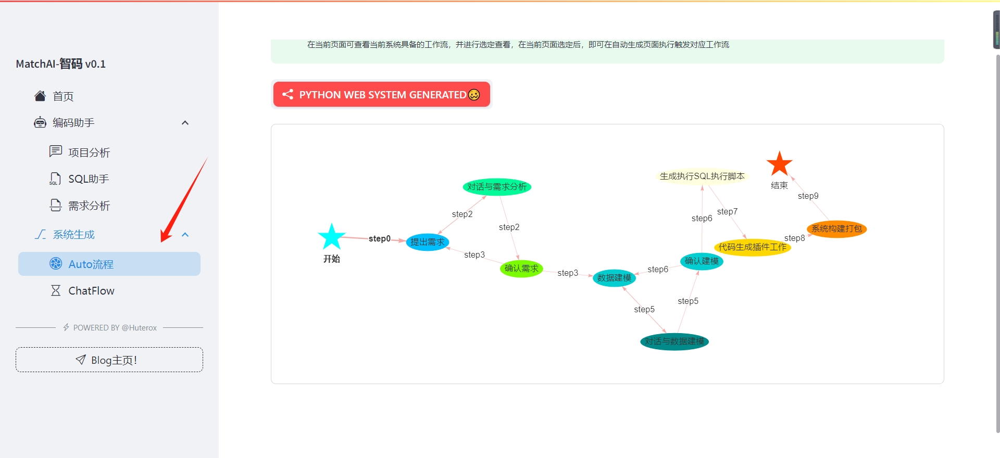
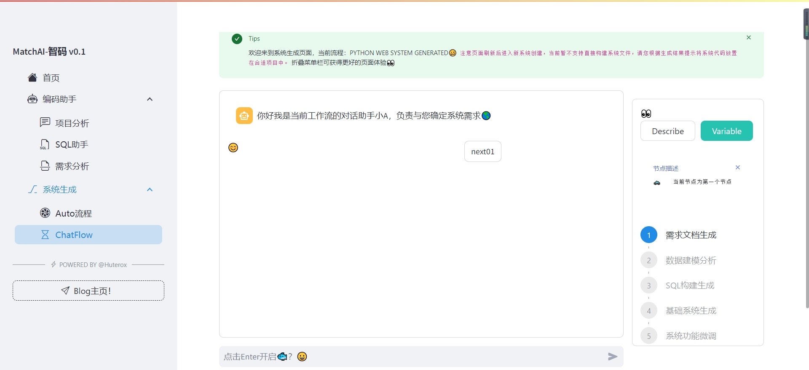

---

### 💡 Get Help - [Q&A](https://gitee.com/Huterox/auto-dev-ops-oups/issues)

---

## Introduction 1️⃣

AutoDevOps-oups is an AI-powered software development automation solution that leverages AI technology to facilitate the software development process, with interactive components developed using Streamlit. It is designed for rapid development of logical functionalities and the creation of verification versions.
The current version is fully open source and in the functional verification phase. We welcome developers to participate and help refine this project. ✔ Additionally, to facilitate learning, the Agent is open, and the project contains many modular components, making it easier to understand the underlying implementation concepts.

## Features and Benefits 2️⃣

- A coding Q&A assistant that supports reading local projects, analyzing project directory structures, and assisting users in understanding source code dependencies 🍳
- An SQL assistant, which currently only supports MySQL databases without an abstracted driver. By setting up database connections, the SQL assistant can help analyze database designs and assist in writing query statements 🐟
- A project requirement assistant where the Agent acts as a project manager, helping to organize project requirements. It includes an internal Whisper for extracting audio files, which will be replaced with FunASR in the future.
- Workflow implementation and project code generation. In this project, we have implemented a simple non-visual workflow (aiming to learn the underlying principles of workflow implementation) and based on this workflow, we have developed a system code generation process.
  - Dialog-based analysis of project requirements
  - Database design based on requirements
  - Generation of creation and execution code based on database design
  - Backend specified technology stack is Python Fast API, and the frontend specified technology stack is Vue3 to generate basic system code (CRUD)
  - Based on the basic code and user-confirmed requirements, generate business code for requirements
  - Dialog-based modification of the current system code
  - ❌ Temporarily not supported 😣
    - Full automation of code generation. During the process, we require users to manually switch workflow states (interactively click next step) because we cannot directly determine if the current workflow output meets the user's needs.
      In future versions, we will implement a monitor manager to automatically detect the execution results of the entire workflow and its node components.
    - Considering the performance differences of the current model, we have abandoned the direct generation of code into the base project, instead opting for a markdown explanation to output the system code. This process is akin to `we provide building block components, and users need to assemble them according to the reference instructions, rather than having us do the assembly automatically, but this feature is not unfeasible`

## Quick Start 3️⃣

Before you begin, please ensure you have your OpenAI key ready, which is crucial. In the project's root directory, create a file named:
api.toml
With the following content:
(Please replace "sk-" with your key, and you can also use a relay service to request the use of OpenAI)

[OpenAI Relay Station🌎](https://api.v3.cm/register?aff=Z9EP)

```yaml
[DEFAULT]
default_key = "sk-"
default_base = "https://api"
default_model = "gpt-4o"
default_temperature = 0.5

[WHISPER]
openai_whisper_api = false
faster_whisper_model_default = "tiny"
faster_whisper_model_local = true
faster_whisper_model_local_path = "F:/new/model/tiny"
gpu = false
vad = false
lang = "Automatic recognition"

[MORE]
min_vad = 500
beam_size = 5
whisper_prompt = "Please break sentences correctly and retain punctuation."
temperature = 0.5
crf = 23
quality = "medium"
ffmpeg = "libx264"
log = "error"
```

### 📦 Local Deployment

If you wish to deploy the local source code, please follow these steps:
- Python 3.10+ The development environment for the author is version 3.10, so it is recommended to use version 3.10 or higher for local deployment.
- ```cmd
  pip install -r requirements.txt
  ```
- Execution command:

  ```cmd
  streamlit run main.py --port=8080
  ```

### 🚀 Docker Quick Deployment

We also provide a Dockerfile for quick deployment.

- Execution commands:

  ```cmd
  docker build -t AutoDevOps-oups:latest .
  ```

  ```cmd
  docker run -p 8080:8081 AutoDevOps-oups:latest
  ```
  The service inside the container defaults to port 8080.

If everything is successful, you can access the software's homepage by visiting the server port in your browser.

The software's homepage is shown in the following figure:


## Basic Usage 4️⃣

We will provide a quick introduction to the basic usage of the software here.

### Project Assistant 😶

Before this, please ensure that you have applied for and have an OpenAI key, and have set it in the project settings on the homepage.


When you have questions about the project's functions, you can consult the project assistant.

### Project System Generation 🏎

For other features, there are detailed operation prompts on the corresponding pages. Follow these prompts to operate. However, for system generation, there are still many details to pay attention to.

1. Process selection: Although there is only one process in the current system, this module will be optimized in the future to add new processes. Therefore, before using system generation, you need to enter the following page to select the process.
   Also, the execution diagram of the process will be displayed on the selection page.
   
2. System generation dialogue: After selection (currently only one, so it is the default check, but you need to enter the selection page to set it)
   Then enter the operation page as follows:
   
   Here are some points to note:
   1. On the right sidebar, you can view the execution diagram of the current process.
   2. Pay special attention to the Variable button on the right side, which allows you to view the results of the current process execution. When switching to the next step in the process execution, this value will override the switch, so please check the results in time and save them promptly.
   3. Describe and Variable are actually a set of CheckButtons. When you select Variable, the subsequent actions will default to executing Variable, which means that the results will be automatically opened for viewing each time. If you need to cancel, please click Describe.
      This design is primarily an anti-idling feature.

## Future Iteration Direction 💫

- Add more processes to meet a wider range of needs.
- Extract the functionality implemented in Streamlit and switch the front-end stack, mainly for the following considerations:
  - Performance considerations and subsequent engineering processing of the project
  - Integration of visual workflows, the backend process engine may be based on the current process implementation, or it may be developed based on LangChainFlow
- Determine the development direction of system generation:
  - Generate systems in the form of a mother port 1️⃣
  - Integrate systems in the form of components 2️⃣

--- 
